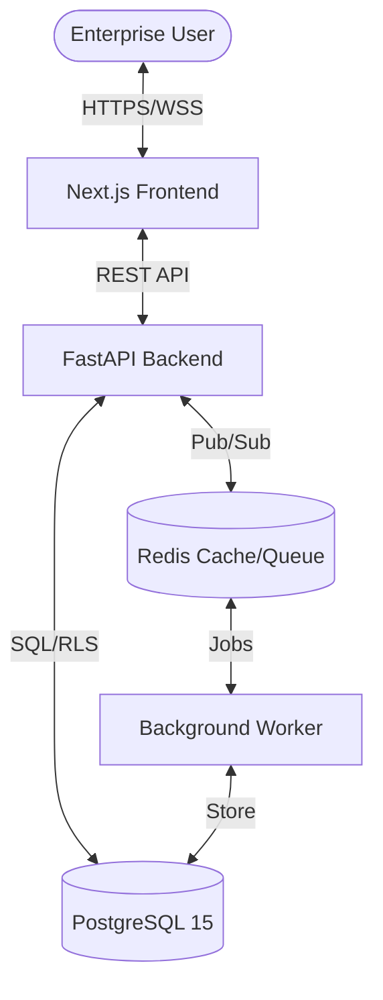

# Tyotrack System Architecture

## Core Components

### 🛡️ Security Layer

- **JWT + Fingerprinting**: Session security.
- **Redis Rate Limiting**: DDoS protection.
- **TOTP 2FA**: Multi-factor authentication.
- **RLS**: Row-Level Security at DB engine level.

### 🧠 Performance & Scalability

- **Materialized Views**: Fast dashboard aggregation.
- **Connection Pooling**: Optimized DB resource usage.
- **Redis Cache**: TTL-based performance boosts.

### 🎨 AAA UI Engine

- **OKLCH Design System**: Premium color space.
- **GSAP Physics**: Motion orchestration.
- **Responsive Layout**: Enterprise-grade adaptability.

## 📓 Secure Ledger Protocol

The `audit_logs` table implements a cryptographic chain:

1. **Entry Creation**: Capture event + metadata.
2. **Payload Hashing**: `SHA-256(user_id + action + timestamp + state_diff)`.
3. **Immutability Check**: Periodic worker task verifies all checksums against current data rows.
4. **Alert Trigger**: Any checksum mismatch triggers an immediate `Intelligence Inbox` alert to Super Admins.
